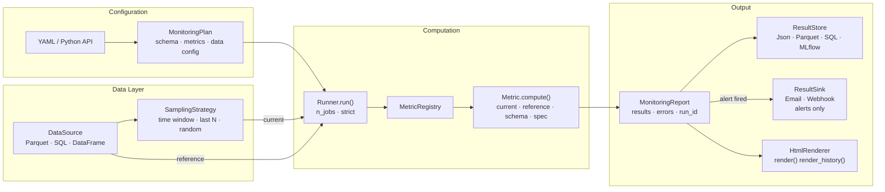

# ayn-ml

**ML monitoring for teams that run classifiers, LLM pipelines, and AI agents — in one library.**

Declarative configuration. Protocol-extensible metric registry. narwhals backend (pandas + Polars).

---

## Why ayn-ml

Most monitoring tools specialise in a single modality. ayn-ml covers tabular ML, NLP/LLM pipelines, and AI agents with a single, consistent API — declarative configuration, a protocol-extensible metric registry, and automatic metric selection via the built-in Advisor.

---

## Installation

```bash
pip install ayn-ml                        # core (narwhals, pandas, Pydantic, scikit-learn, scipy)
pip install ayn-ml[polars]               # add Polars backend (recommended for production)
pip install ayn-ml[mlflow]               # MLflow store
pip install ayn-ml[nlp]                  # BLEU, ROUGE, BERTScore
pip install ayn-ml[all]                  # everything
```

> **Python >= 3.10 required.**

---

## Quick start

### Define a monitoring plan

```python
from ayn_ml import MonitoringPlan, TabularSchema, MetricSpec

schema = TabularSchema(
    label_col="y_true",
    prediction_col="y_pred",
    feature_types={"tenure": "categorical"},   # override int-encoded column
)

plan = MonitoringPlan(
    name="churn_model_monitoring",
    model_id="churn_model",
    model_version="2.1",
    data_schema=schema,
    metrics=[
        MetricSpec(name="accuracy", threshold=0.85, upper_bound=False),
        MetricSpec(name="psi", feature_name="age", threshold=0.2),
        MetricSpec(name="f1", threshold=0.80, upper_bound=False),
    ],
)
```

### Or load from YAML

```yaml
# churn_plan.yaml
name: churn_model_monitoring
model_id: churn_model
model_version: "2.1"
data_schema:
  type: tabular
  label_col: y_true
  prediction_col: y_pred
metrics:
  - name: accuracy
    threshold: 0.85
    upper_bound: false
  - name: psi
    feature_name: age
    threshold: 0.2
```

```python
from ayn_ml.io import MonitoringPlan

plan = MonitoringPlan.from_yaml("churn_plan.yaml")
```

### Run and inspect results

```python
from ayn_ml.runner import Runner
from ayn_ml.renderers import HtmlRenderer
from ayn_ml.stores import InMemoryStore

store = InMemoryStore()
report = Runner().run(plan, current=df_current, reference=df_reference, store=store)

print(report.to_dataframe())
#    metric_name  metric_type  value   status  effect_size effect_size_label  threshold
# 0     accuracy  performance   0.82    False         None              None       0.85
# 1          psi        drift   0.31    False         None              None       0.20
# 2           f1  performance   0.79    False         None              None       0.80

report_html = HtmlRenderer().render(report)              # snapshot report — HTML string
```

### Let the advisor build the plan for you

Don't know which drift test to use for a skewed feature, or whether to use F1 or accuracy on an
imbalanced dataset? `MetricAdvisor` answers both questions from the data itself.

```python
from ayn_ml.advisor import MetricAdvisor
from ayn_ml.core.schema import TabularSchema

schema = TabularSchema(label_col="y_true", prediction_col="y_pred", proba_col="y_prob")
designer = MetricAdvisor(schema)

result = designer.suggest(
    df_current,
    reference=df_reference,   # required — training baseline or historical window
    task_type="classification",
)

plan  = result.plan      # MonitoringPlan — pass directly to Runner
for w in result.warnings:
    print(w)
# Advisory: accuracy demoted: imbalance ratio 7.3:1
# Advisory: levene added for 'income': variance_ratio=1.91
```

The advisor inspects every feature column independently:
- **Numeric columns** → normality test (Shapiro-Wilk / D'Agostino / skewness heuristic by sample size) → ttest or Mann-Whitney U, plus CvM, Wasserstein, PSI; Levene added when variance shifts
- **Categorical columns** → PSI + chi-square
- **Performance** → accuracy demoted or excluded when class imbalance is detected; F1 + AUCPR promoted
- **Sample-size guards** → Wasserstein only for n < 30; PSI + Wasserstein only for n > 50 000 (no hypothesis tests at that scale)

The generated plan is a standard `MonitoringPlan` — fully editable before you pass it to `Runner`.
Extended metric selection with additional statistical tests and descriptive metrics is available in [ayn-ml Pro](https://kevek-ml.github.io/ayn-ml/pro/).

→ [Full advisor reference](https://kevek-ml.github.io/ayn-ml/advisor/) · [Notebook walkthrough](examples/09_advisor.ipynb)

---

### Works with pandas and Polars

```python
import pandas as pd
import polars as pl
from ayn_ml.runner import Runner

# both work — narwhals handles the backend
report_pd = Runner().run(plan, current=df_pandas, reference=df_ref_pandas)
report_pl = Runner().run(plan, current=df_polars, reference=df_ref_polars)
```

### Add custom metrics

```python
from typing import Any
from ayn_ml.metrics import register_metric
from ayn_ml.core.result import MetricResult
from ayn_ml.core.schema import DataSchema
from ayn_ml.core.spec import MetricSpec, MetricType

@register_metric("business_accuracy")
class BusinessAccuracyMetric:
    """Accuracy weighted by business cost per error type."""

    name = "business_accuracy"
    metric_type = MetricType.custom
    requires_reference = False

    def compute(
        self,
        current: Any,
        reference: Any | None,
        schema: DataSchema,
        spec: MetricSpec,
    ) -> MetricResult:
        # weight errors by business cost
        ...
```

### Persist and alert

```python
from ayn_ml.stores import InMemoryStore, SqliteStore

# In-memory store (tests / notebooks)
store = InMemoryStore()

# Persistent local store (zero extra dependencies)
store = SqliteStore("monitoring.db")

report = Runner().run(
    plan,
    current=df_current,
    reference=df_reference,
    store=store,          # always persisted
)

# Read back the history as flat rows
rows = store.read_history("churn_model", limit=30)
```

For cloud deployments, an S3-compatible store and Slack notifications are available in [ayn-ml Pro](https://kevek-ml.github.io/ayn-ml/pro/).

---

## Architecture



```
ayn_ml/
├── core/          # MetricSpec, MonitoringPlan, ExecutionContext, MonitoringReport
├── metrics/       # registry + built-in metrics (tabular, nlp, agent)
├── data/          # DataSource, SamplingStrategy
├── models/        # ModelWrapper (sklearn, HuggingFace, LangChain, MLflow)
├── runner.py      # stateless orchestrator
├── advisor/       # MetricAdvisor — automatic MonitoringPlan generation from data
├── stores/        # ResultStore — InMemoryStore, SqliteStore (+ ParquetStore, MlflowStore planned)
├── sinks/         # ResultSink — EmailChannel, WebhookChannel
├── renderers/     # HtmlRenderer (render + render_history), PlotlyBackend
├── explain/       # DriftAttributor (advanced XAI in commercial edition)
└── io/            # MonitoringPlan.from_yaml / to_yaml
```

**Backend:** [narwhals](https://github.com/narwhals-dev/narwhals) — write once, run on pandas or Polars.

### Configuration

`MonitoringPlan` is the top-level config object — it binds a data schema, model identity, the list of metrics to compute, and optional window and sampling directives. Plans are immutable Pydantic models that round-trip through YAML. Schema columns default to `None`; declare only what exists in your DataFrame and the Runner validates presence at runtime.

→ [Schema reference](https://kevek-ml.github.io/ayn-ml/schemas/) · [Architecture reference](https://kevek-ml.github.io/ayn-ml/architecture/)

### Data Layer

`DataSource` loads and projects raw data to the columns the plan needs. `SamplingStrategy` narrows it to the right window (time-based, last-N rows, or random subsampling). Current and reference are passed as independent sources — the reference is typically a training baseline or a frozen snapshot.

→ [Full data layer reference](https://kevek-ml.github.io/ayn-ml/data-layer/)

### Metric Advisor

`MetricAdvisor` is a data-driven plan generator. It analyses each feature column (column type,
sample size, normality, skewness, optional variance ratio vs. a reference window) and selects the
statistically appropriate drift tests, performance metrics, and descriptive statistics for a
`MonitoringPlan`. The result is a frozen `SuggestedPlan` with the plan and a list of advisory
messages explaining every routing decision.

→ [Full advisor reference](https://kevek-ml.github.io/ayn-ml/advisor/)

### Computation

`Runner.run()` validates column presence upfront (`strict=True` by default), then executes each `MetricSpec` against the data windows. Metrics are resolved from the registry and run sequentially or in parallel (`n_jobs`). Per-metric errors are isolated — one failing metric never aborts the others.

→ [Metrics reference](https://kevek-ml.github.io/ayn-ml/metrics/)

### Output

`MonitoringReport` aggregates all metric results, errors, and fired alerts for a single run. Each report carries a `run_id` (auto UUID) for store correlation, period bounds derived from the timestamp column, and row counts (`n_current`, `n_reference`). Persist via `ResultStore`, notify via `ResultSink`, or render to HTML.

→ [Architecture reference](https://kevek-ml.github.io/ayn-ml/architecture/)

---

## Data schema

A schema maps logical column roles to physical column names in your DataFrame. ayn-ml supports four modalities: `TabularSchema` (supervised ML), `TextSchema` (NLP / LLM), `AgentSchema` (agent traces), and `RecSysSchema` (recommender systems).

→ [Full schema reference](https://kevek-ml.github.io/ayn-ml/schemas/)

---

## Data layer

```
DataSource  →  SamplingStrategy  →  current
   load          narrow window
DataSource  ─────────────────→  reference  (training baseline or frozen snapshot)
```

`DataFrameSource.load(plan)` projects an in-memory DataFrame to the minimal column set the plan needs. `CsvSource(path)` reads a CSV file from disk with the same projection — Polars is used when available, with pandas as the fallback and no extra dependencies required. `ExcelSource(path)` reads a worksheet from an Excel file via an opt-in extra (`pip install ayn-ml[excel]`); supports both Polars (`fastexcel`) and pandas (`openpyxl`) backends with automatic fallback. Window and sampling configs live on the plan and round-trip through YAML.

→ [Full data layer reference](https://kevek-ml.github.io/ayn-ml/data-layer/)

---

## Supported metrics

71 built-ins: 57 tabular (performance, drift, statistics, CBPE estimation, fairness) + 14 recsys (precision_at_k, recall_at_k, fbeta_at_k, hit_rate, map_at_k, ndcg_at_k, mrr_at_k, diversity, novelty, popularity_bias, personalization, item_bias, user_bias, serendipity). NLP and agent metrics coming.

→ [Full metrics reference](https://kevek-ml.github.io/ayn-ml/metrics/)

---

## Development

```bash
git clone https://github.com/Kevek-ml/ayn-ml
cd ayn-ml
python -m venv .venv && source .venv/bin/activate
pip install -e ".[all]"
pip install pre-commit
pre-commit install
```

**Code quality:** ruff (lint + format + docstring presence), pytest.

```bash
pre-commit run --all-files   # ruff + pytest
```

All public and internal symbols carry **Google-style docstrings** (Args, Returns, Raises).

---

## Roadmap

| | Status |
|-------|--------|
| `core/` — types, schemas, specs | ✅ done |
| `metrics/` — registry + 57 tabular built-in (incl. 5 CBPE estimation, 3 fairness) + 14 recsys | ✅ done |
| `data/` — sources, sampling, partitioning | ✅ done |
| `runner.py` | ✅ done |
| `models/` — wrappers | ⏳ coming |
| `stores/` — InMemoryStore, SqliteStore | ✅ done |
| `sinks/` — ResultSink protocol + EmailChannel + WebhookChannel | ✅ done |
| `renderers/` — HtmlRenderer, PlotlyBackend, NoChartBackend | ✅ done |
| `advisor/` — MetricAdvisor, automatic MonitoringPlan generation | ✅ done |
| NLP metrics | ⏳ coming |
| Agent metrics | ⏳ coming |
| `explain/` — DriftAttributor | ⏳ coming |

---

## ayn-ml Pro

ayn-ml Pro extends the library with capabilities for production teams:

- **Advanced Advisor** — `standard` and `comprehensive` monitoring plans, tuned to your model type, data volume, and risk profile
- **Cloud Runner** — scheduled runs, parallel execution, retry logic, and a full audit trail
- **Slack notifications** — real-time alerts when drift or performance degradation is detected
- **S3 storage** — persist monitoring history to any S3-compatible object store
- **LLM safety & quality metrics** — toxicity detection, hallucination rate, and LLM-judge scoring for relevance, faithfulness, and coherence
- **Agent metrics** — step efficiency, goal adherence, and reasoning quality for multi-step agentic workflows
- **Explainability** — SHAP-based drift attribution, LLM-powered drift explanation, and experimental XAI modules
- **Analytics Dashboard** — historical trends, multi-team access control (RBAC), and SSO

→ [Learn more](https://kevek-ml.github.io/ayn-ml/pro/) · ayn-ml Pro is a commercial product by Kevek ML.

---

## License

Apache 2.0 — see [LICENSE](LICENSE).
